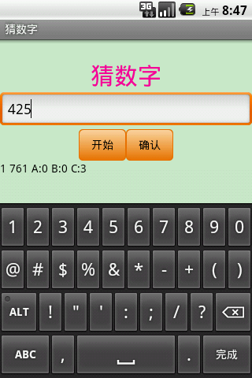

README
===

## 简介
猜数字是一个益智小游戏。游戏规则简单、容易上手，却包含着无穷的智慧。通过本游戏，可以锻炼玩家的逻辑推理能力。
## 规则
玩家选择所猜数字的位数和次数。点击“开始”产生一个随机数，玩家输入一个数字，点击“确认”进行猜测，程序根据猜测的数字和实际数字给出判断结果（“A”表示数值和位数均正确，“B”表示仅数值正确，“C”表示没有该数值）。玩家需根据结果进行推理，直至猜出准确数字。
## 截图
**游戏界面**

**获胜界面**

